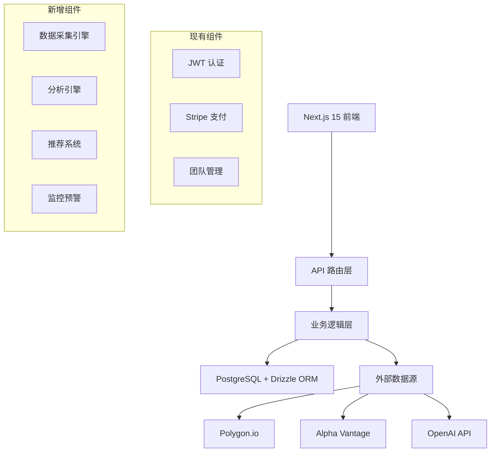

# InsightTrader 股票分析平台部署设计文档

## 1. 平台概述

### 1.1 项目愿景
基于现有 Next.js SaaS 架构构建的专业股票分析平台，提供四维度综合分析：宏观经济、基本面、技术面、情感分析。继承现有用户管理、支付和认证体系，专注于金融分析功能开发。

### 1.2 技术架构


## 2. 数据库设计

### 2.1 核心表结构扩展
```sql
-- 股票基础信息表
CREATE TABLE stocks (
  id SERIAL PRIMARY KEY,
  symbol VARCHAR(10) UNIQUE NOT NULL,
  company_name VARCHAR(255) NOT NULL,
  sector VARCHAR(100),
  industry VARCHAR(100),
  market_cap BIGINT,
  created_at TIMESTAMP DEFAULT NOW(),
  updated_at TIMESTAMP DEFAULT NOW()
);

-- 用户观察列表表
CREATE TABLE watchlists (
  id SERIAL PRIMARY KEY,
  user_id INTEGER REFERENCES users(id),
  name VARCHAR(100) NOT NULL,
  description TEXT,
  created_at TIMESTAMP DEFAULT NOW(),
  updated_at TIMESTAMP DEFAULT NOW()
);

-- 观察列表股票关联表
CREATE TABLE watchlist_stocks (
  id SERIAL PRIMARY KEY,
  watchlist_id INTEGER REFERENCES watchlists(id),
  stock_id INTEGER REFERENCES stocks(id),
  added_at TIMESTAMP DEFAULT NOW()
);

-- 时间序列价格数据表
CREATE TABLE stock_prices (
  id SERIAL PRIMARY KEY,
  stock_id INTEGER REFERENCES stocks(id),
  timestamp TIMESTAMP NOT NULL,
  open DECIMAL(10,4) NOT NULL,
  high DECIMAL(10,4) NOT NULL,
  low DECIMAL(10,4) NOT NULL,
  close DECIMAL(10,4) NOT NULL,
  volume BIGINT NOT NULL,
  interval VARCHAR(10) NOT NULL -- '1m', '5m', '1h', '1d'
);

-- 基本面数据表
CREATE TABLE fundamentals (
  id SERIAL PRIMARY KEY,
  stock_id INTEGER REFERENCES stocks(id),
  report_date TIMESTAMP NOT NULL,
  quarter VARCHAR(10),
  year INTEGER NOT NULL,
  revenue BIGINT,
  net_income BIGINT,
  eps DECIMAL(8,4),
  pe DECIMAL(8,2),
  pb DECIMAL(8,2),
  roe DECIMAL(8,4),
  debt_to_equity DECIMAL(8,4),
  created_at TIMESTAMP DEFAULT NOW()
);

-- 技术指标表
CREATE TABLE technical_indicators (
  id SERIAL PRIMARY KEY,
  stock_id INTEGER REFERENCES stocks(id),
  timestamp TIMESTAMP NOT NULL,
  sma_50 DECIMAL(10,4),
  sma_200 DECIMAL(10,4),
  rsi_14 DECIMAL(6,2),
  macd DECIMAL(10,6),
  macd_signal DECIMAL(10,6),
  bb_upper DECIMAL(10,4),
  bb_lower DECIMAL(10,4),
  obv BIGINT
);

-- 新闻文章表
CREATE TABLE news_articles (
  id SERIAL PRIMARY KEY,
  stock_id INTEGER REFERENCES stocks(id),
  title VARCHAR(500) NOT NULL,
  content TEXT,
  source VARCHAR(100),
  url TEXT,
  published_at TIMESTAMP NOT NULL,
  sentiment_score DECIMAL(4,3), -- -1.000 to 1.000
  sentiment_label VARCHAR(20), -- 'positive', 'neutral', 'negative'
  summary TEXT,
  created_at TIMESTAMP DEFAULT NOW()
);

-- 分析推荐记录表
CREATE TABLE recommendations (
  id SERIAL PRIMARY KEY,
  stock_id INTEGER REFERENCES stocks(id),
  timestamp TIMESTAMP DEFAULT NOW(),
  recommendation VARCHAR(20) NOT NULL, -- 'strong_buy', 'buy', 'hold', 'sell', 'strong_sell'
  confidence DECIMAL(4,3) NOT NULL, -- 0.000 to 1.000
  reasoning TEXT NOT NULL,
  technical_score DECIMAL(4,3),
  fundamental_score DECIMAL(4,3),
  sentiment_score DECIMAL(4,3),
  macro_score DECIMAL(4,3)
);

-- 用户预警设置表
CREATE TABLE alerts (
  id SERIAL PRIMARY KEY,
  user_id INTEGER REFERENCES users(id),
  stock_id INTEGER REFERENCES stocks(id),
  type VARCHAR(50) NOT NULL, -- 'price', 'technical', 'recommendation'
  condition TEXT NOT NULL, -- JSON配置
  is_active BOOLEAN DEFAULT TRUE,
  last_triggered TIMESTAMP,
  created_at TIMESTAMP DEFAULT NOW()
);
```

## 3. 前端架构设计

### 3.1 页面结构扩展
```
app/
├── (dashboard)/
│   ├── stocks/                    # 新增股票功能模块
│   │   ├── page.tsx              # 股票列表/观察列表
│   │   ├── [symbol]/             
│   │   │   └── page.tsx          # 股票详情分析仪表盘
│   │   ├── watchlist/            # 观察列表管理
│   │   └── alerts/               # 预警设置
│   ├── market/                    # 市场概况
│   │   ├── overview/             # 宏观经济指标
│   │   └── sectors/              # 行业分析
│   └── settings/                  # 扩展现有设置
```

### 3.2 核心组件设计

#### 3.2.1 股票分析仪表盘
```typescript
// components/stock/StockDashboard.tsx
interface StockDashboardProps {
  symbol: string;
  timeframe?: '1D' | '1W' | '1M' | '3M' | '1Y';
}

// 主要模块：
// - StockHeader: 基本信息、价格、涨跌幅
// - TradingChart: 交互式K线图
// - FundamentalMetrics: 财务指标卡片
// - TechnicalIndicators: 技术指标摘要
// - NewsPanel: 新闻情感分析
// - RecommendationCard: AI推荐卡片
```

#### 3.2.2 观察列表管理
```typescript
// components/watchlist/WatchlistManager.tsx
interface WatchlistManagerProps {
  userId: number;
}

// 功能特性：
// - 多列表管理和切换
// - 股票搜索和添加
// - 实时价格更新
// - 批量操作支持
```

### 3.3 界面设计系统

#### 3.3.1 金融主题色彩
```css
:root {
  /* 主品牌色 */
  --primary: #2563eb;
  --primary-dark: #1d4ed8;
  
  /* 金融语义色 */
  --bullish: #16a34a;       /* 上涨绿 */
  --bearish: #dc2626;       /* 下跌红 */
  --neutral: #6b7280;       /* 中性灰 */
  
  /* 评级颜色 */
  --strong-buy: #16a34a;
  --buy: #22c55e;
  --hold: #eab308;
  --sell: #f97316;
  --strong-sell: #dc2626;
}
```

#### 3.3.2 响应式布局
```css
.stock-dashboard {
  @apply grid gap-6;
  @apply grid-cols-1 md:grid-cols-2 lg:grid-cols-3 xl:grid-cols-4;
}

.main-chart {
  @apply col-span-full lg:col-span-2 h-96 lg:h-[500px];
}
```

## 4. 后端服务设计

### 4.1 API 路由架构
```typescript
// app/api/ - 新增API路由
// stocks/route.ts - 股票搜索和列表
// stocks/[symbol]/route.ts - 股票基本信息
// stocks/[symbol]/prices/route.ts - 价格数据
// stocks/[symbol]/fundamentals/route.ts - 基本面数据
// stocks/[symbol]/technicals/route.ts - 技术指标
// stocks/[symbol]/news/route.ts - 新闻和情感分析
// stocks/[symbol]/recommendation/route.ts - 推荐分析
// watchlists/route.ts - 观察列表CRUD
// alerts/route.ts - 预警系统
```

### 4.2 数据采集引擎
```typescript
// lib/services/data-ingestion.ts
export class DataIngestionService {
  // 实时价格数据采集
  async collectRealtimePrices(symbols: string[]): Promise<void>
  
  // 历史数据采集
  async collectHistoricalData(symbol: string): Promise<void>
  
  // 基本面数据采集
  async collectFundamentals(symbol: string): Promise<void>
  
  // 新闻数据采集和情感分析
  async collectAndAnalyzeNews(symbol: string): Promise<void>
}
```

### 4.3 分析引擎设计

#### 4.3.1 技术分析模块
```typescript
// lib/analysis/technical.ts
export class TechnicalAnalysisEngine {
  calculateSMA(prices: number[], period: number): number[]
  calculateRSI(prices: number[], period: number = 14): number[]
  calculateMACD(prices: number[]): { macd: number[], signal: number[] }
  calculateBollingerBands(prices: number[], period: number = 20): BollingerBands
  calculateTechnicalScore(indicators: TechnicalIndicators): number
}
```

#### 4.3.2 基本面分析模块
```typescript
// lib/analysis/fundamental.ts
export class FundamentalAnalysisEngine {
  calculateFinancialRatios(fundamentals: FundamentalData): FinancialRatios
  compareWithIndustry(symbol: string, ratios: FinancialRatios): ComparisonResult
  calculateFundamentalScore(ratios: FinancialRatios): number
}
```

#### 4.3.3 情感分析模块
```typescript
// lib/analysis/sentiment.ts
export class SentimentAnalysisEngine {
  async analyzeNewsSentiment(articles: NewsArticle[]): Promise<SentimentResult>
  calculateSentimentTrend(sentiments: SentimentScore[]): TrendResult
  calculateSentimentScore(sentiments: SentimentScore[]): number
}
```

#### 4.3.4 推荐引擎
```typescript
// lib/analysis/recommendation.ts
export class RecommendationEngine {
  private readonly WEIGHTS = {
    technical: 0.25,
    fundamental: 0.35,
    sentiment: 0.20,
    macro: 0.20,
  };
  
  calculateOverallScore(scores: AnalysisScores): OverallScore
  generateRecommendation(overallScore: OverallScore): RecommendationResult
  generateReasoning(scores: AnalysisScores): string
}
```

## 5. 数据源集成

### 5.1 主要数据供应商
```typescript
// lib/data-sources/config.ts
export const DATA_SOURCES = {
  primary: {
    name: 'Polygon.io',
    baseUrl: 'https://api.polygon.io',
    features: ['real-time', 'historical', 'options'],
    rateLimit: { requests: 5, period: 'minute' },
  },
  secondary: {
    name: 'Alpha Vantage', 
    baseUrl: 'https://www.alphavantage.co',
    features: ['fundamentals', 'economic-indicators'],
    rateLimit: { requests: 25, period: 'day' },
  },
  llm: {
    name: 'OpenAI',
    model: 'gpt-4-turbo',
    features: ['sentiment-analysis', 'summarization'],
  }
};
```

### 5.2 数据采集策略
```typescript
// lib/data-sources/scheduler.ts
export class DataScheduler {
  // 实时数据：WebSocket连接，1秒更新
  scheduleRealtimeData(): void
  
  // 日线数据：每日收盘后更新
  scheduleDailyData(): void
  
  // 基本面数据：季度财报发布后更新
  scheduleFundamentalData(): void
  
  // 新闻数据：每15分钟采集一次
  scheduleNewsData(): void
}
```

## 6. Vercel 部署配置

### 6.1 环境变量配置
```bash
# .env.production
# 现有变量保持不变
POSTGRES_URL="postgres://..."
STRIPE_SECRET_KEY="sk_..."
NEXTAUTH_SECRET="..."

# 新增数据源API密钥
POLYGON_API_KEY="your_polygon_api_key"
ALPHA_VANTAGE_API_KEY="your_alpha_vantage_key"
OPENAI_API_KEY="your_openai_api_key"

# 数据库连接池配置
DATABASE_MAX_CONNECTIONS=20
DATABASE_CONNECTION_TIMEOUT=30000

# 缓存配置
REDIS_URL="redis://..."
CACHE_TTL=300
```

### 6.2 部署优化配置
```typescript
// next.config.ts
const nextConfig = {
  experimental: {
    serverComponentsExternalPackages: ['chart.js', 'canvas'],
  },
  
  images: {
    domains: ['cdn.polygon.io', 'financialmodelingprep.com'],
  },
  
  // API缓存配置
  async headers() {
    return [
      {
        source: '/api/stocks/:symbol/prices',
        headers: [
          {
            key: 'Cache-Control',
            value: 'public, s-maxage=60, stale-while-revalidate=300',
          },
        ],
      },
    ];
  },
};
```

### 6.3 性能优化策略

#### 6.3.1 缓存策略
```typescript
// lib/cache/strategy.ts
export const CACHE_CONFIG = {
  // 实时价格：短期缓存
  prices: { ttl: 60, stale: 300 },
  
  // 基本面数据：长期缓存
  fundamentals: { ttl: 3600, stale: 86400 },
  
  // 技术指标：中期缓存
  technicals: { ttl: 300, stale: 1800 },
  
  // 新闻数据：中期缓存
  news: { ttl: 900, stale: 3600 },
};
```

#### 6.3.2 数据预加载
```typescript
// lib/preload/strategy.ts
export class DataPreloader {
  // 用户登录时预加载观察列表数据
  async preloadWatchlistData(userId: number): Promise<void>
  
  // 页面访问时预加载相关股票数据
  async preloadStockData(symbol: string): Promise<void>
  
  // 市场开盘前预加载热门股票数据
  async preloadMarketData(): Promise<void>
}
```

## 7. 开发和部署流程

### 7.1 开发阶段规划

#### 7.1.1 Phase 1: MVP (4-6周)
- 基础数据模型和API设计
- 股票搜索和观察列表功能
- 基本价格图表展示
- 简单的技术指标计算
- Alpha Vantage数据源集成

#### 7.1.2 Phase 2: 核心分析 (6-8周)
- Polygon.io实时数据集成
- 完整技术分析模块
- 基本面分析功能
- OpenAI情感分析集成
- 第一版推荐引擎

#### 7.1.3 Phase 3: 智能化增强 (4-6周)
- 高级推荐算法优化
- 预警监控系统
- 性能优化和缓存
- 移动端适配
- 用户体验优化

### 7.2 质量保证

#### 7.2.1 测试策略
```typescript
// __tests__/analysis/technical.test.ts
describe('TechnicalAnalysisEngine', () => {
  test('calculates SMA correctly', () => {
    // 技术指标计算准确性测试
  });
  
  test('generates valid technical scores', () => {
    // 技术评分合理性测试
  });
});

// __tests__/api/stocks.test.ts
describe('Stocks API', () => {
  test('returns valid stock data', () => {
    // API响应格式和数据有效性测试
  });
});
```

#### 7.2.2 监控和告警
```typescript
// lib/monitoring/alerts.ts
export class SystemMonitor {
  // 数据源API健康监控
  monitorDataSourceHealth(): void
  
  // 数据质量监控
  monitorDataQuality(): void
  
  // 性能监控
  monitorPerformance(): void
  
  // 错误率监控
  monitorErrorRates(): void
}
```

## 8. 安全和合规

### 8.1 数据安全
- API密钥安全存储（Vercel环境变量）
- 用户数据加密存储
- API访问速率限制
- 敏感财务数据访问控制

### 8.2 金融数据合规
- 数据使用许可协议遵守
- 数据延迟和免责声明
- 投资建议免责条款
- 用户协议和隐私政策

### 8.3 性能保障
- 99.9%可用性目标
- API响应时间<500ms
- 数据更新延迟<1秒
- 自动故障恢复机制

通过这个设计文档，InsightTrader平台将在现有SaaS架构基础上，成功实现专业级股票分析功能，为用户提供科学可靠、界面美观、功能完整的投资决策支持工具。